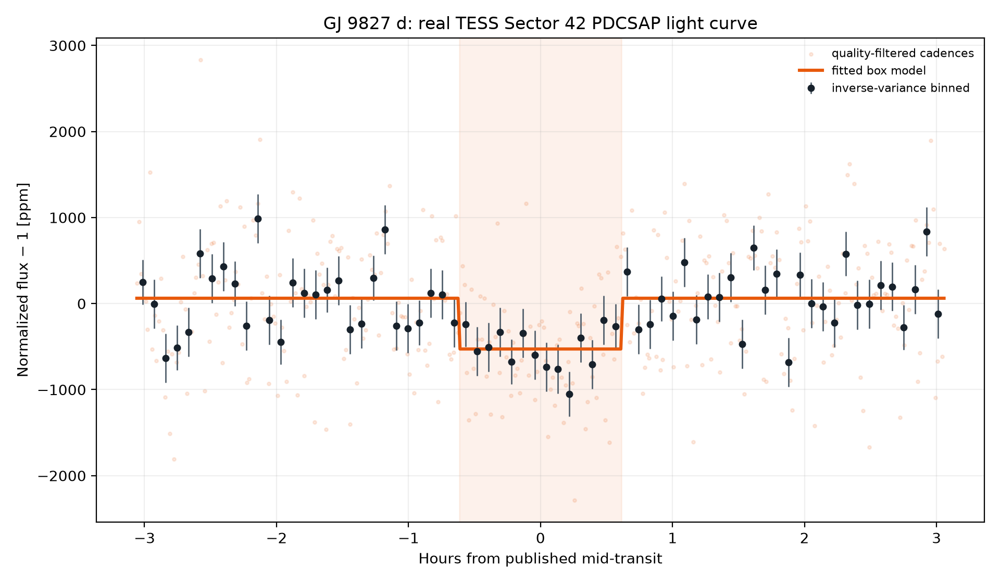
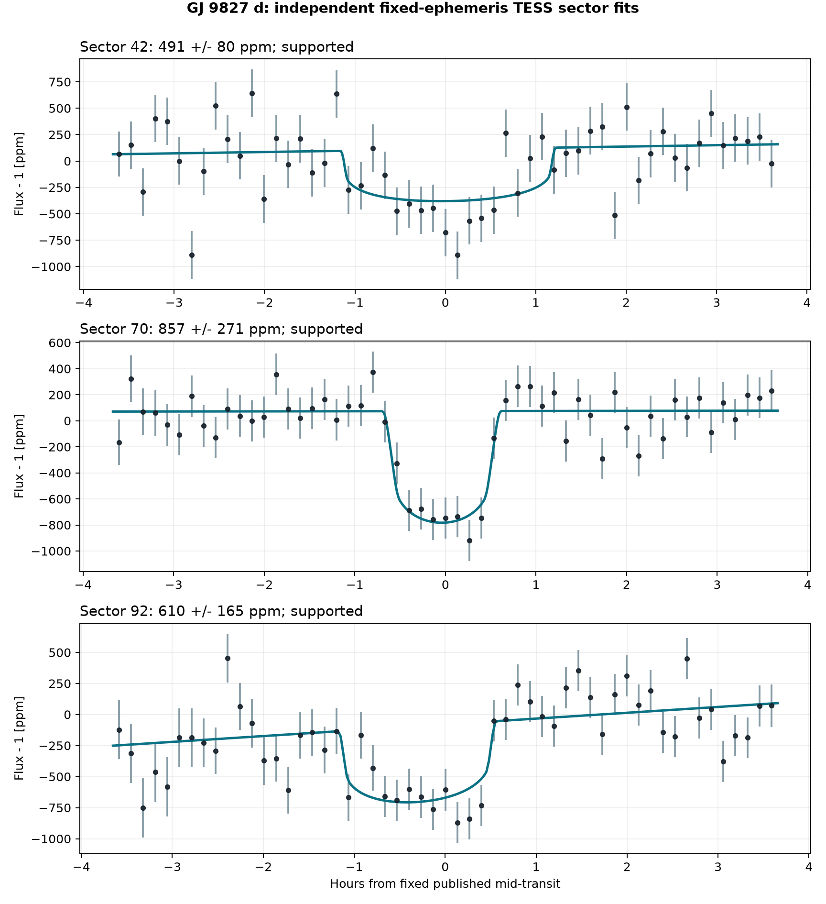
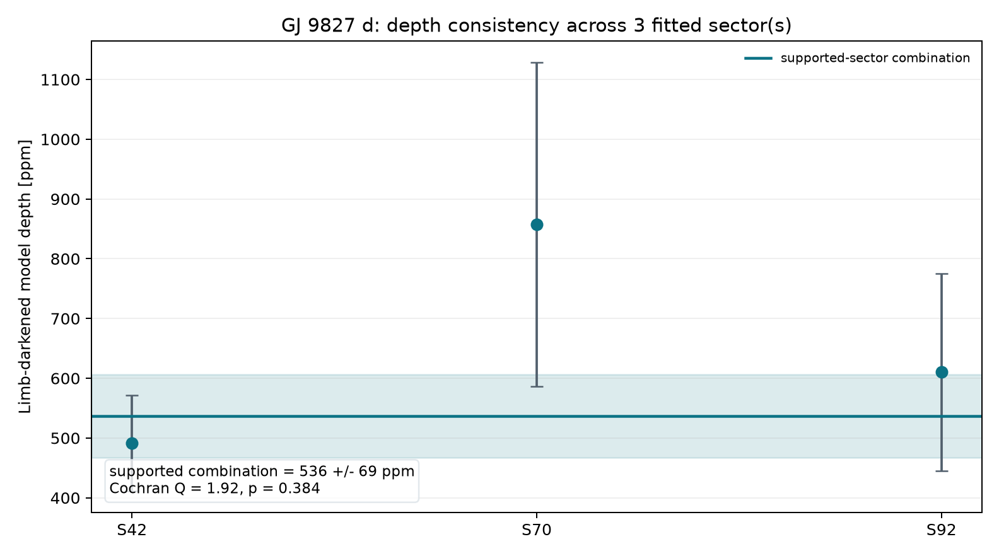
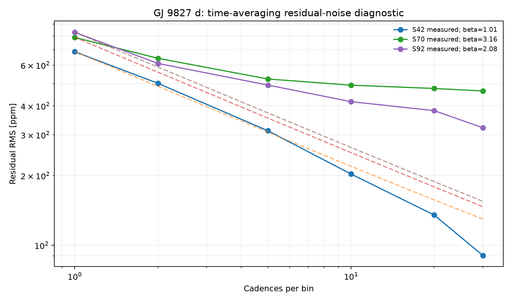

# GJ 9827 d: A Dense Super-Earth at the Atmosphere Boundary
<!-- RESEARCH-IDENTITY-START -->
**Independent research report by [Biswajit Jana](https://biswajit1999.github.io/Biswajit_Jana.github.io/)** · [Live report](https://biswajit1999.github.io/gj9827d-exoplanet-report/) · [ORCID](https://orcid.org/0009-0002-2411-1891) · [Complete research portfolio](https://biswajit1999.github.io/Biswajit_Jana.github.io/research/exoplanets/)
<!-- RESEARCH-IDENTITY-END -->


<!-- TARGET-IDENTITY-START -->
<p align="center">
  
</p>

<p align="center"><em>AI-generated artist's interpretation informed by the measured system properties; not a direct image.</em></p>

**Super-Earth · atmosphere boundary · TESS photometry**

A nearby planet near the transition between rocky worlds and volatile-rich sub-Neptunes, analyzed here with a timing-aware TESS transit pipeline.
<!-- TARGET-IDENTITY-END -->
<p align="center">
  
</p>


**[Open the full report](https://biswajit1999.github.io/gj9827d-exoplanet-report/)** — the live GitHub Pages version.

## Data sources

- **System parameters** — the saved `pscomppars` row from the [NASA Exoplanet Archive TAP service](https://exoplanetarchive.ipac.caltech.edu/TAP/sync?query=select+pl_name%2Chostname%2Cra%2Cdec%2Cpl_orbper%2Cpl_tranmid%2Cpl_trandur%2Cpl_rade%2Cpl_bmasse%2Cpl_eqt%2Cpl_orbsmax%2Csy_dist%2Csy_tmag%2Cst_teff%2Cst_rad%2Cst_mass%2Cdisc_year%2Cdiscoverymethod%2Cdisc_refname%2Cdisc_pubdate%2Cdisc_facility+from+pscomppars+where+pl_name%3D%27GJ+9827+d%27&format=csv).
- **Observed photometry** — three unmodified MAST SPOC 2-minute light curves from TESS Sectors 42, 70, and 92, DOI [10.17909/t9-nmc8-f686](https://doi.org/10.17909/t9-nmc8-f686). These are real reduced light curves, not simulated data.
- Exact URLs, IDs, retrieval date, and SHA-256 checksum are in [`data/SOURCE.md`](data/SOURCE.md).

## Reproduce the analysis

```bash
pip install -r requirements.txt
python scripts/analyze_transit.py
python scripts/analyze_multisector.py
pytest tests/ -v
```

The script keeps finite `QUALITY == 0` cadences, normalizes `PDCSAP_FLUX`, and applies one symmetric robust outlier rule. A local linear null is compared with a circular quadratic-limb-darkened transit. The archive period and predicted phase are retained, while midpoint, radius ratio, impact parameter, baseline, and baseline slope are fitted inside a bounded window. The limb-darkening coefficients and scaled semi-major axis are fixed and disclosed in the CSV.

## What the corrected fit shows

| Quantity | Result |
|---|---:|
| TESS sector | 42 |
| Cadences in fitted window | 442 |
| Transit support | **Supported — ΔBIC = 28.2 (lower-margin within this portfolio)** |
| Midpoint correction | +0.032 h ± 3.35 min |
| Model mid-transit depth | 491.5 ± 78.7 ppm |
| Radius ratio Rp/Rs | 0.02037 |
| Fitted / published duration | 2.353 / 1.226 h |
| Linear null χ² / dof / BIC | 558.99 / 440 / 571.17 |
| Transit χ² / dof / BIC | 512.54 / 437 / 542.99 |
| ΔBIC (null − transit) | 28.18 |

The timing-adjusted transit is strongly preferred by ΔBIC = 28.2. Its fitted midpoint is +0.032 hours from the historical prediction; the model's mid-transit depth is 491.5 ± 78.7 ppm. A fitted timing correction can diagnose ephemeris drift, but this single-sector fit is not a replacement for a global transit-timing analysis.

<!-- MULTISECTOR-UPGRADE-START -->
## Multi-sector robustness and correlated noise

The archive prediction was timing-adjusted independently in Sectors 42, 70, and 92; all three meet ΔBIC ≥ 10. Formal depth errors were inflated by sqrt(max(reduced χ², 1)) times the residual time-averaging beta factor (range 1.01–3.16). The robust inverse-variance model depth is 536.5 ± 69.4 ppm. Cochran's Q = 1.92 for 2 degrees of freedom (p = 0.384), so this diagnostic does not detect excess depth dispersion after the red-noise inflation. That absence of detected heterogeneity is not proof of a common physical depth: only three sectors are available, Sector 70 has strong time-correlated residuals, and this is not a Gaussian-process or global transit fit.

<p align="center"></p>

<p align="center"></p>

<p align="center"></p>

The per-sector table is in [`figures/multisector_statistics.csv`](figures/multisector_statistics.csv). Regenerate all three figures with `python scripts/analyze_multisector.py`.
<!-- MULTISECTOR-UPGRADE-END -->

## System context

- Radius: 1.98 Earth radii
- Mass: 3.02 Earth masses
- Orbital period: 6.201830 days
- Transit duration: 1.226 hours
- Semi-major axis: 0.0530 AU
- Equilibrium temperature: 675 K
- Host: GJ 9827 · distance 29.66 pc
- Discovery: 2017 by Transit (K2)

## Limitations

- The orbit is assumed circular and the quadratic limb-darkening coefficients are fixed representative values; they are not atmosphere-grid interpolations.
- Sector 42 is a lower-margin supported result (ΔBIC 28.2), while Sectors 70 and 92 are stronger under the same fixed protocol. Sector 70's beta = 3.16 flags substantial short-timescale residual correlation and correspondingly broadens its uncertainty.
- The scaled semi-major axis is derived from the saved composite semi-major axis and stellar radius; their uncertainties are not propagated.
- Midpoint freedom corrects accumulated ephemeris error but introduces a bounded timing search. ΔBIC, not a naïve one-parameter p-value, is used as the support gate.
- PDCSAP processing, dilution, stellar variability, transit-timing variations, and long-timescale covariance can still bias the inferred geometry.
- Radius ratio, impact parameter, and fixed limb darkening are correlated. Published global fits with physical priors and simultaneous detrending remain authoritative.

## Repository structure

```text
README.md
index.html
requirements.txt
data/                       unmodified TESS FITS + NASA row + SOURCE.md
scripts/analyze_transit.py  timing-adjusted limb-darkened transit fit
figures/                    generated plot + summary_statistics.csv
tests/                      real-data regression tests
.github/workflows/tests.yml CI on every push and pull request
LICENSE                     MIT
```

## References

1. [Niraula et al. 2017](https://ui.adsabs.harvard.edu/abs/2017AJ....154..266N/abstract) — discovery reference as listed by the NASA Exoplanet Archive.
2. Ricker, G. R. et al. (2015), *Transiting Exoplanet Survey Satellite (TESS)*, JATIS 1, 014003, [doi:10.1117/1.JATIS.1.1.014003](https://doi.org/10.1117/1.JATIS.1.1.014003).
3. TESS Team, *TESS Light Curves — All Sectors*, MAST, [doi:10.17909/t9-nmc8-f686](https://doi.org/10.17909/t9-nmc8-f686); Sectors 42, 70, and 92 used here.
4. [NASA Exoplanet Archive](https://exoplanetarchive.ipac.caltech.edu/), `pscomppars` TAP row retrieved 2026-08-15.

## Author

Biswajit Jana — [Portfolio](https://biswajit1999.github.io/Biswajit_Jana.github.io/) · [GitHub](https://github.com/Biswajit1999) · [LinkedIn](https://www.linkedin.com/in/biswajit-jana-27011a151/) · [ORCID](https://orcid.org/0009-0002-2411-1891)
